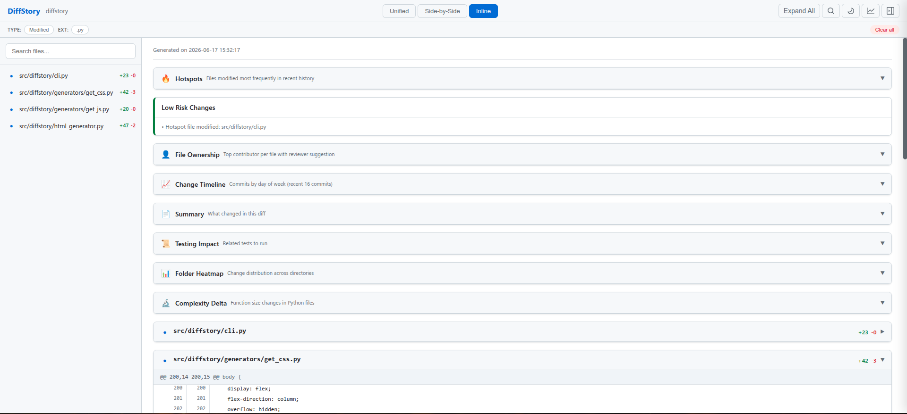
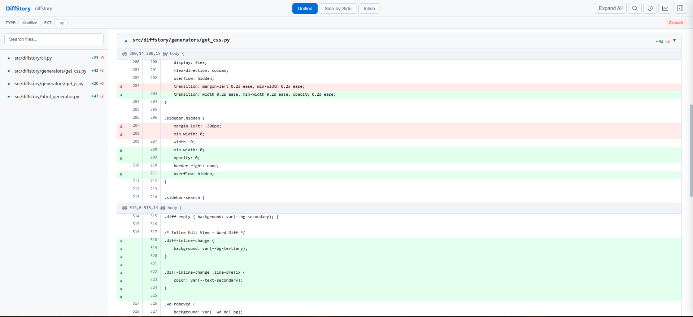
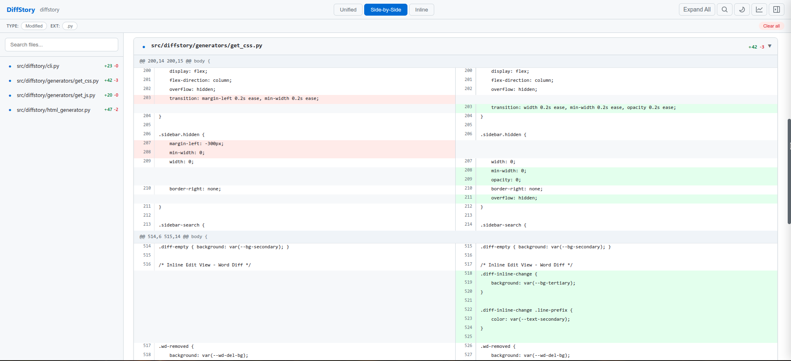
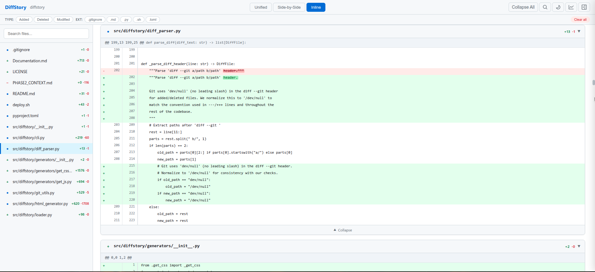
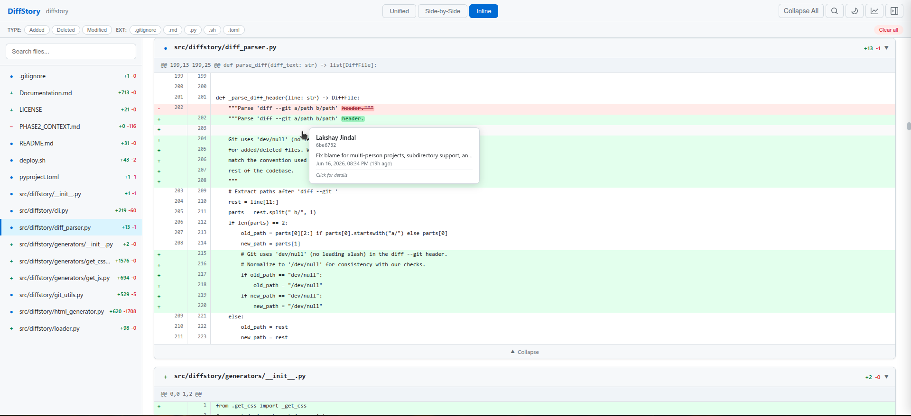

<div align="center">

# DiffStory

**Transform Git diffs into rich, interactive, self-contained HTML reports.**

[](https://pypi.org/project/diffstory/)
[](https://pypi.org/project/diffstory/)
[](https://github.com/lakshayjindal/diffstory/blob/main/LICENSE)
[](https://pypi.org/project/diffstory/)

Understand not just *what* changed, but *who* changed it, *when*, and *why* — all offline, in a single portable file.

```bash
pip install diffstory
cd my-repo
diffstory --staged
# Opens a .html in your browser
```

</div>

---

## Screenshots


---

## Why DiffStory?

Reading a diff in your terminal works — until it doesn't.

| Tool | Limitation |
|---|---|
| **`git diff`** | Plain text, no navigation, no blame context, no sharing. |
| **`git blame`** | Standalone per-file, disconnected from the diff. Requires the repository. |
| **`diff2html`** | HTML output but no blame, no offline sharing, no analytics, no search. |
| **PR reviews** | Tied to GitHub/GitLab. No offline access. Cannot be archived or emailed. |

DiffStory combines `git diff`, `git blame`, and `git log` into a single interactive HTML report — no server, no accounts, no data leaving your machine.

---

## Features

| Feature | Description |
|---|---|
| **Unified View** | Classic git-style diff with line numbers and syntax highlighting. |
| **Side-by-Side View** | Original (left) and modified (right) columns, visually aligned. |
| **Inline View** | Word-level diff — green additions and red strikethrough removals on one line. |
| **Blame Integration** | Hover any line for author, commit, subject, and relative time. Click for full commit details. |
| **Provenance Metadata** | Author, date, commit message, files changed, insertions, deletions — per commit. |
| **Search** | Global search across file names, authors, commit subjects, and code content. |
| **Filters** | Narrow by file extension (`.py`, `.js`, `.html`) or change type (added, deleted, modified, renamed). |
| **Statistics** | Floating dashboard with file counts, add/delete deltas, author breakdown, and top changed files. |
| **Dark Mode** | Instant toggle, persists across sessions. |
| **Offline Reports** | All CSS, JS, and data embedded. Works in any modern browser with zero network access. |
| **Single HTML Output** | One file — no assets, no server, no dependencies. |
| **Portable Sharing** | Email, archive, attach to a PR, or file for compliance. No repository access needed to view. |

### Additional Capabilities

- **Keyboard navigation** — `J`/`K` to move between files, `F` or `/` to search, `U`/`S`/`I` to switch views
- **Deep linking** — `#file-0` or `#L-0-42` links to specific files and lines
- **Binary file detection** — Image previews and metadata placeholders
- **Export formats** — JSON, Markdown, and CSV alongside HTML (`--json`, `--md`, `--csv`)
- **Review mode** — Per-file checkboxes with localStorage persistence (`--review`)
- **Config file** — `~/.diffstory.toml` or `.diffstory.toml` for persistent defaults

---

## Installation

```bash
pip install diffstory
```

**Requires:** Python 3.10+ and Git.

From source:

```bash
git clone https://github.com/lakshayjindal/diffstory.git
cd diffstory
pip install -e .
```

---

## Quick Start

```bash
# Working tree diff
diffstory

# Staged changes
diffstory --staged

# Commit comparison
diffstory HEAD~1 HEAD

# Branch comparison with path restriction
diffstory main feature/auth src/

# Custom output
diffstory -o report.html

# Generate from a diff file (no git repo needed)
diffstory --diff /path/to/patch.diff

# Multiple export formats
diffstory --staged --json --md --csv
```

---

## What Makes DiffStory Different?

| Feature | `git diff` | `diff2html` | DiffStory |
|---|---|---|---|
| HTML report | — | ✓ | ✓ |
| Offline sharing | — | — | ✓ |
| Blame / provenance | — | — | ✓ |
| Line-level author info | — | — | ✓ |
| Interactive navigation | — | ✓ | ✓ |
| Search across files | — | — | ✓ |
| Filter by type / extension | — | — | ✓ |
| Statistics dashboard | — | — | ✓ |
| Dark mode | — | — | ✓ |
| Keyboard shortcuts | — | — | ✓ |
| Deep linking | — | — | ✓ |
| Commit evolution slider | — | — | ✓ |
| Risk analysis & hotspots | — | — | ✓ |
| Single-file output | — | ✓ | ✓ |
| No runtime dependencies | ✓ | — | ✓ |

---

## Screenshots and Walkthrough

### Overview



The main report screen. A sidebar lists all changed files with add/delete counts. The diff content area renders each file with its full change history. The toolbar gives access to view switching, search, theme, statistics, and the file list.

**Why it matters:** You get the full context of a changeset in one view — no scrolling between terminal windows or switching between `git diff` and `git blame`.

### Unified View



The default view. Lines are color-coded: green for additions, red for deletions. Line numbers for both old and new files are displayed side by side. Syntax highlighting is applied via Pygments.

**Why it matters:** Familiar to anyone who uses `git diff`, but with syntax highlighting and interactive features that the terminal cannot provide.

### Side-by-Side View



Original file on the left, modified file on the right. Lines are aligned by position. Useful for understanding structural changes at a glance.

**Why it matters:** For large refactors or renames, seeing both versions side by side reveals patterns that a unified diff obscures.

### Inline View



Word-level diffs. Instead of showing a removed line and an added line, changed words are highlighted inline — removed text is struck through in red, added text is highlighted in green.

**Why it matters:** When a single word changes on a long line, finding the difference in a unified diff requires careful scanning. The inline view makes it obvious instantly.

### Blame Tooltip



Hover any changed line to see a tooltip with the author name, commit hash, commit subject, date, and relative time. Click the line to open a full commit detail drawer.

**Why it matters:** Answers "who wrote this line and why?" without leaving the report. No more switching to a terminal to run `git blame`.

### Statistics Dashboard


A floating panel with file counts, add/delete deltas, author and commit counts, contributor breakdown, and a table of the most-changed files.

**Why it matters:** Gives an instant high-level summary of the changeset — useful for code reviews, release notes, and stakeholder updates.

---

## Typical Use Cases

| Use Case | Description |
|---|---|
| **Code Reviews** | Generate a report from a branch diff and share the link or file. Reviewers get interactive blame, search, and filtering — no GitHub/GitLab account required. |
| **Release Reviews** | Before shipping, run `diffstory v1.0..v2.0` to get a complete picture of everything that changed between releases. |
| **QA Verification** | QA engineers can search for specific files, filter by change type, and inspect blame without CLI access. |
| **Client Deliverables** | Share a self-contained HTML report with clients or stakeholders. They see exactly what changed without needing access to your repository. |
| **Audit Trails** | Archive reports for compliance. Every report is a timestamped, self-contained document with full provenance. |
| **Code Archaeology** | Trace who changed what and when in a specific file or function across commits. |
| **Historical Investigations** | Run `diffstory` on any range of commits to reconstruct the evolution of a feature or bug fix. |

---

## Architecture

```
diffstory/                      # PyPI package
├── cli.py                      # Argument parsing, orchestration
├── git_utils.py                # Git subprocess wrappers (diff, blame, log)
├── diff_parser.py              # Unified diff → structured data
├── syntax.py                   # Pygments syntax highlighting
├── html_generator.py           # Self-contained HTML generation
└── generators/
    ├── get_css.py              # All CSS (inline)
    └── get_js.py               # All JavaScript (inline)
```

- **Python 3.10+** — Zero external Python dependencies except Pygments (for syntax highlighting).
- **Git CLI** — All Git operations go through `subprocess`. No GitPython dependency.
- **Self-contained HTML** — CSS, JavaScript, and data (blame, commits, search index) are embedded directly. No assets to serve, no network requests.
- **Offline-first** — Everything runs locally. Generated reports work without internet access, indefinitely.

---

## Philosophy

DiffStory is not trying to replace GitHub, GitLab, Bitbucket, or Git itself.

It exists to solve a specific problem: **creating portable, shareable, interactive change reports** that work anywhere, independent of infrastructure.

- Reports are static files. Open them in any browser. Email them. Archive them. Attach them to tickets.
- No accounts. No servers. No data leaves your machine.
- The report answers the five questions reviewers actually ask: *What changed? Who changed it? When? Why? How did it evolve?*

---

## Roadmap

Ideas for future releases — nothing guaranteed:

- [ ] **Annotations & comments** — Inline commenting on specific lines, saved to the report
- [ ] **PDF export** — Print-quality report generation
- [ ] **Diff comparison** — Compare two reports side by side
- [ ] **Plugin system** — Custom analyzers and visualizations
- [ ] **WebSocket live reload** — Watch file changes and regenerate reports automatically
- [ ] **Language-specific analysis** — TypeScript type changes, Rust borrow checker impact, etc.
- [ ] **Team review workflows** — Aggregate reviews from multiple team members

---

## Contributing

Contributions are welcome. The project is small and the codebase is straightforward.

- **Issues** — Bug reports, feature requests, and questions.
- **Pull requests** — Please open an issue first to discuss the change.
- **Local development** — `pip install -e .` for editable install. Run `diffstory --staged` in any repo to test.

```bash
git clone https://github.com/lakshayjindal/diffstory.git
cd diffstory
pip install -e .
diffstory --staged -o /tmp/test.html
```

---

## License

MIT
